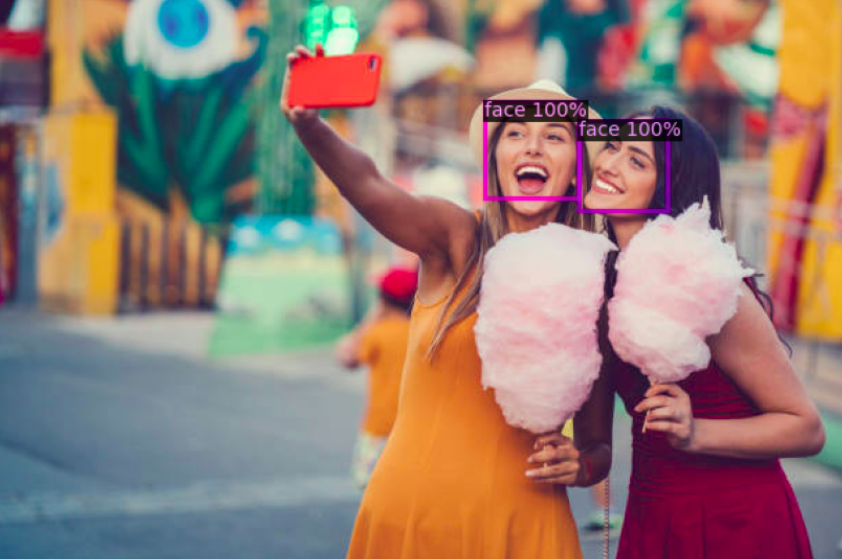
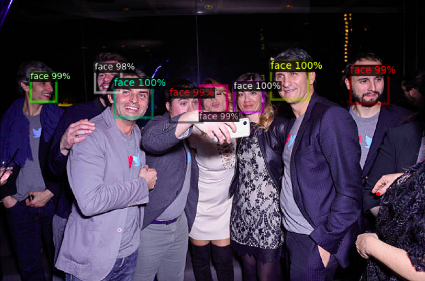

<h1 align="center">Fine-tuning FasterRCNN for Face Detection</h1>
<p align="center">
    
</p>

## Setting Up
1. Clone the repository:
```
git clone https://github.com/Illia-tsar/face-detection-with-fasterrcnn.git
cd face-detection-with-fasterrcnn
```
2. Create and activate the virtual environment:
```
python -m venv <virtual-environment-name>
source <virtual-environment-name>/bin/activate
```
3. Install project requirements:
```
pip install -r requirements.txt
```
4. Install detectron2. You can follow the [installation guide](https://detectron2.readthedocs.io/en/latest/tutorials/install.html), 
or simply:
```
pip install 'git+https://github.com/facebookresearch/detectron2.git'
```

## Description
* Dataset: [Count the number of Faces present in an Image](https://www.kaggle.com/datasets/vin1234/count-the-number-of-faces-present-in-an-image?select=test.csv)
* Library: [detectron2](https://detectron2.readthedocs.io/en/latest/)

The mentioned dataset was used in conjunction with detectron2 in order to fine-tune *FasterRCNN*. The weights pretrained 
on ImageNet were used as a starting point. During this process, the first 2 stages of model's backbone were frozen. 
The *FasterRCNN* model was trained for 12000 iterations, having 1200 iterations reserved for warmup, increasing the 
learning rate linearly up to 0.0005. At iterations 3000 and 8000 learning rate was decreased by a factor of 0.1. 
The obtained metrics are shown in the table below:

|   AP   |  AP50  |  AP75  |  APs   |  APm   |  APl   |
|:------:|:------:|:------:|:------:|:------:|:------:|
| 46.698 | 95.582 | 34.417 | 38.448 | 47.637 | 48.467 |

The attained weights can be downloaded [here.](https://drive.google.com/file/d/1OQdvq0QsRNRdNhmMpPklBj0bPBqhBdrj/view?usp=share_link)

## Visualization
<p align="center">
    
</p>

The [visualization_explained.ipynb](src/visualization_explained.ipynb), which is located under *src* directory demonstrates how to plot ground truth, or predicted, 
bounding boxes with only one line of code, utilizing *SimpleVisualizer* class. It also shows an example of predicting 
bounding boxes for an arbitrary image, plotting them in the image, and saving the obtained result to some location.

## Basic Usage

To start training with default parameters, you have to specify the data directory like so:
```
python training.py --data_path <data-directory>
```
To get the description of other arguments as well as their default values, simply run:
```
python training.py --help
```
